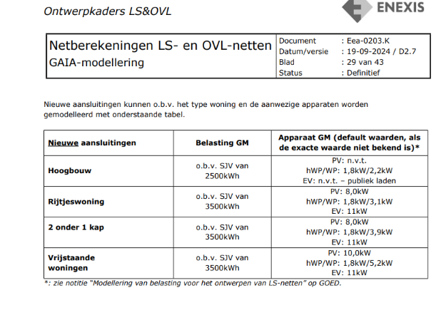
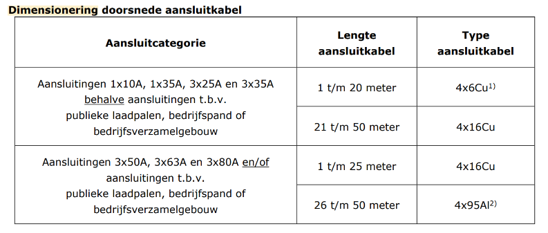
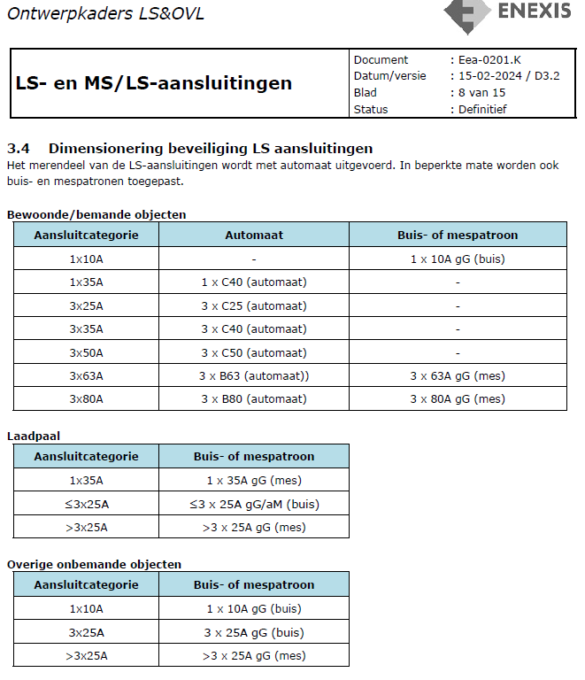

# Een nieuwe aansluiting aanmaken in GAIA

Soms vraagt een aanvraag om een nieuwbouwproject. Hiervoor moet dan ook in het .gnf-bestand de nieuwe aansluiting worden ontworpen om de berekening uit te voeren. Het is hierbij belangrijk om een duidelijk beeld te krijgen van de wensen van de klant en het karakter van de aanvraag ([[captoets-form|Aanvraaginformatie achterhalen]]).

### Stappenplan: Aansluiting plaatsen
1. Splits de LS-Kabel af met [[topologisch-splitsen]] en maak van de splitsing een [[aam-mof]].
2. Selecteer de [[aam-mof]] en rechtermuisklik -> Aansluiting.
3. Vul het adres rechtsboven in, deze is te vinden in de [[captoets-form|Captoets informatie]].
4. Voor huisaansluitingen:
   1. Vul de GM-gegevens in volgens de [[ontwerpkaders]];
   2. Vul de PV, Warmtepomp, en Laadpaal (EV) gegevens in op basis van de "Apparaat GM" kolom;
      1. Zie de [[enexis-ontwerpkaders-gm-belasting.png|figuur]] uit de ontwerpkaders;
      2. Als de klant een *redelijke* PV-waarde geeft in de aanvraag, vul je deze in mits deze groter is dan de ontwerpkaders. 
   3. Pas de juiste [[aansluit-kabel]] toe op basis van de [[enexis-ontwerpkaders-aansluit-kabels.png|figuur]] uit de ontwerpkaders.
   4. Pas het [[mespatroon]] aan;
      1. Zie de [[enexis-ontwerpkaders-mespatronen.png|figuur]] uit de ontwerpkaders.
   5. Ga naar *Presentatie*: zet de kleur naar blauw, en de grootte op 5.
5. Voor een laadpaal:
   1. *Nog niet af*
6. Voor een bedrijfsaansluiting:
   1. *Nog niet af*

### Ontwerpkaders Figuren

[//begin]: # "Autogenerated link references for markdown compatibility"
[enexis-ontwerpkaders-gm-belasting.png|figuur]: enexis-ontwerpkaders-gm-belasting.png "enexis-ontwerpkaders-gm-belasting.png"
[enexis-ontwerpkaders-aansluit-kabels.png|figuur]: enexis-ontwerpkaders-aansluit-kabels.png "enexis-ontwerpkaders-aansluit-kabels.png"
[enexis-ontwerpkaders-mespatronen.png|figuur]: enexis-ontwerpkaders-mespatronen.png "enexis-ontwerpkaders-mespatronen.png"
[//end]: # "Autogenerated link references"
